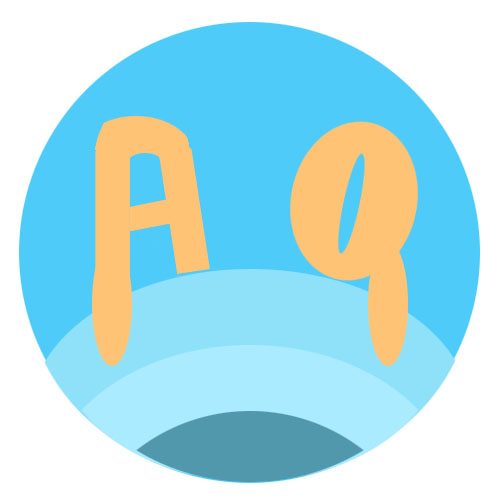

<!-- PROJECT SHIELDS -->
[![Contributors][contributors-shield]][contributors-url]

<!-- PROJECT LOGO -->
 

  

<!-- ABOUT THE PROJECT -->
## About Me

  

### Hi there 👋

🖥 I am an entry-level software developer specializing in full-stack development and recommendation system analysis.\
🗒 I recently worked on many projects that dealt with extracting data from social media and sanitizing their meanings with the OpenAI API. \
🖌 I am also active in developing and maintaining websites made by start-ups, along with testing. \
👯 I am open to any new challenges and would like to join a team that also shares a similar passion. \
📫 How to reach me: [Qin-blue?style=flat&logo=Linkedin&logoColor=white)][linkedin-url] [][Gmail-url]\
⚡ Fun fact:  I found chatGPT's dad jokes really funny

### ❤ Known Technologies
[![JavaScript][JS.com]][JS-url] [![React][React.js]][React-url] [![Bootstrap][Bootstrap.com]][Bootstrap-url] [![JQuery][JQuery.com]][JQuery-url] [![Node Js][NodeJs.org]][NodeJs-url] [![Python][Python.org]][Python-url] [![Django][Django.com]][Django-url]

### 💔 None Technologies
[![C++][CPP.com]][CPP-url]

### 💯 My Stats

(<a href="#readme-top">back to top</a>)

<!-- CONTACT -->
## Contact
E-Mail - qinandy2001@gmail.com

LinkedIn - [Yihui(Andy) Qin](https://www.linkedin.com/in/yihui-qin/)

Github Link - [AndyQYH](https://github.com/AndyQYH/AndyQYH)

(<a href="#readme-top">back to top</a>)

<!-- MARKDOWN LINKS & IMAGES -->
<!-- https://www.markdownguide.org/basic-syntax/#reference-style-links -->
[contributors-shield]: https://img.shields.io/github/contributors/AndyQYH/AndyQYH.svg?style=for-the-badge
[contributors-url]: https://github.com/AndyQYH/AndyQYH/graphs/contributors
[forks-shield]: https://img.shields.io/github/forks/AndyQYH/AndyQYH.svg?style=for-the-badge
[forks-url]: https://github.com/AndyQYH/AndyQYH/network/members
[stars-shield]: https://img.shields.io/github/stars/AndyQYH/AndyQYH.svg?style=for-the-badge
[stars-url]: https://github.com/AndyQYH/AndyQYH/stargazers
[issues-shield]: https://img.shields.io/github/issues/AndyQYH/AndyQYH.svg?style=for-the-badge
[issues-url]: https://github.com/AndyQYH/AndyQYH/issues
[license-shield]: https://img.shields.io/github/license/AndyQYH/AndyQYH.svg?style=for-the-badge
[license-url]: https://github.com/AndyQYH/AndyQYH/blob/master/LICENSE.txt
[linkedin-shield]: https://img.shields.io/badge/-LinkedIn-black.svg?style=for-the-badge&logo=linkedin&colorB=555
[linkedin-url]: https://linkedin.com/in/yihui-qin
[my-portray]: images/Andy-portray2-large.png
[JS.com]: https://img.shields.io/badge/JavaScript-000000?style=for-the-badge&logo=javascript&logoColor=F7DF1E
[JS-url]: https://www.javascript.com/
[React.js]: https://img.shields.io/badge/React-20232A?style=for-the-badge&logo=react&logoColor=61DAFB
[React-url]: https://reactjs.org/
[Django.com]: https://img.shields.io/badge/Django-44B78B?style=for-the-badge&logo=django&logoColor=092E20
[Django-url]: https://www.djangoproject.com/
[Angular.io]: https://img.shields.io/badge/Angular-DD0031?style=for-the-badge&logo=angular&logoColor=white
[Angular-url]: https://angular.io/
[Python.org]: https://img.shields.io/badge/Python-3776AB?style=for-the-badge&logo=python&logoColor=FFD846
[Python-url]: https://www.python.org/
[CPP.com]: https://img.shields.io/badge/C++-00599C?style=for-the-badge&logo=cplusplus&logoColor=white
[CPP-url]: https://cplusplus.com/
[Bootstrap.com]: https://img.shields.io/badge/Bootstrap-563D7C?style=for-the-badge&logo=bootstrap&logoColor=white
[Bootstrap-url]: https://getbootstrap.com
[JQuery.com]: https://img.shields.io/badge/jQuery-0769AD?style=for-the-badge&logo=jquery&logoColor=white
[JQuery-url]: https://jquery.com 
[NodeJs.org]: https://img.shields.io/badge/NodeJs-339933?style=for-the-badge&logo=nodedotjs&logoColor=white
[NodeJs-url]: https://nodejs.org/en
[Gmail-url]: mailto:qinandy2001@gmail.com
